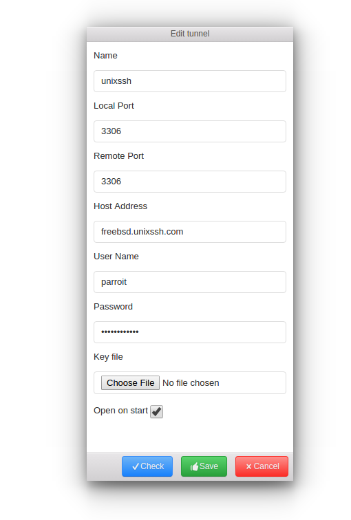
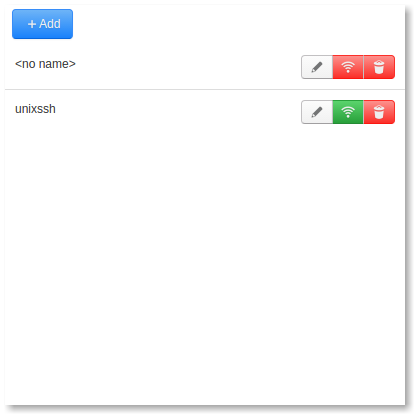

# Tunnels

> Awesome [Electron](http://electron.atom.io/) app to manage your ssh tunnels.

> Keep a list of ssh tunnel to your remotes and open them all at once.

[](http://travis-ci.org/parro-it/tunnels)
[](https://npmjs.org/package/electron-tunnels)
[](https://npmjs.org/package/electron-tunnels)

### Tunnel edit window



### Tunnels list window



### UI restyle coming in version 1.3.0


# Installation

## Linux

[**Download**](https://github.com/parro-it/tunnels/releases/latest) and unzip to some location.

To run the app, execute the `Tunnels` file.

To add a shortcut to the app, create a file in `~/.local/share/applications` called `Tunnels.desktop` with the following contents:

```
[Desktop Entry]
Name=Tunnels
Exec=/full/path/to/folder/Tunnels
Terminal=false
Type=Application
Icon=/full/path/to/folder/Tunnels/resources/app/media/IconTemplate.png
```

## OS X [_package not tested_](https://github.com/parro-it/tunnels/issues/4)

[**Download**](https://github.com/parro-it/tunnels/releases/latest), unzip, and move `Tunnels.app` to the `/Applications` directory.


## Windows [_package not tested_](https://github.com/parro-it/tunnels/issues/4)

[**Download**](https://github.com/parro-it/tunnels/releases/latest) and unzip to some location.

To run the app, execute the `Tunnels` file.

## NPM

Install the module globally:

```bash
npm install -g electron-tunnels
```

start the app from your terminal:

```bash
tunnels
```


# Development

## Setup environment

```bash
git clone https://github.com/parro-it/tunnels.git
cd tunnels
npm i
npm run rebuild
npm start
```

## Lint your code

```bash
npm run lint
```

## Run tests

```bash
npm test
```

> some tests requires an account defined on freebsd.unixssh.com
> to run them, setup an account there, and then define `UNIXSSH_USER`
> and `UNIXSSH_PWD` environment variables before running tests.
> If these two env are not found, these tests are skipped.


# Todo

* [*] Package the app for Linux, OSX, Windows
* [ ] Make the app autolunch at startup
* [ ] Provide visual feedback when tunnels are opening
* [ ] Save tunnel passwords in system keychain
* [ ] Improve UI


# Related modules

* [open-ssh-tunnel](https://github.com/parro-it/open-ssh-tunnel) - Tunneling module at the core of this app

* [Caprine](https://github.com/sindresorhus/caprine) - Install instructions and scripts are copied from this app.

# Credits

* App icons come from [Entypo icon set](www.entypo.com) by [Daniel Bruce](http://www.danielbruce.se/)

# License

The MIT License (MIT)

Copyright (c) 2015 Andrea Parodi


